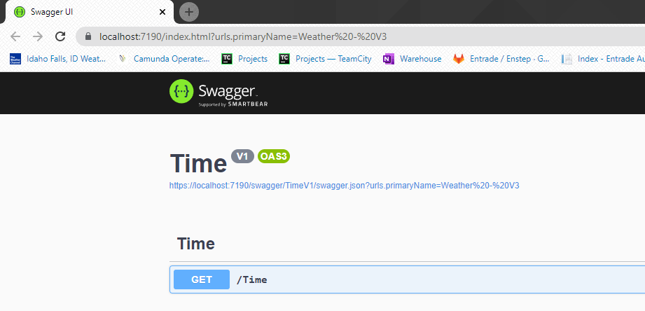

# Steps to Recreate the Problem

* Run the application.  You should see a browser appear with the swagger page.
* You will see two defitions in the "Select a definition" drop down.
* You may toggle between the two without issues.  It will show the correct controllers for the correct definition.
* Switch to the "Weather - V3" definition
* Copy the URL from the browser
   * https://localhost:7190/index.html?urls.primaryName=Weather%20-%20V3
* Switch to the "Time - V1" definition
* Paste the Weather URL to the browser and press enter to switch to this URL
   * https://localhost:7190/index.html?urls.primaryName=Weather%20-%20V3
   * Even though it is showing the weather URL in the URL bar, it is showing the "Time" controllers.  
   * I believe this is a bug and it should be showing the weather controllers.
   

   