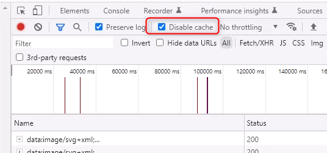
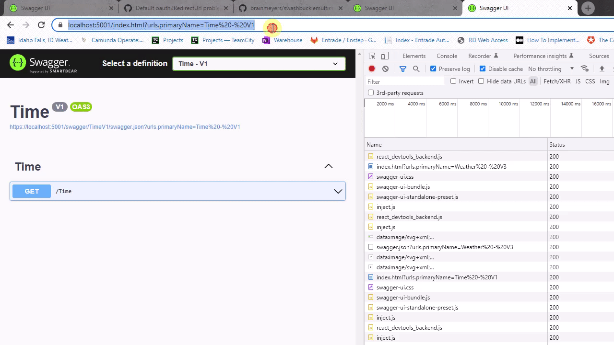
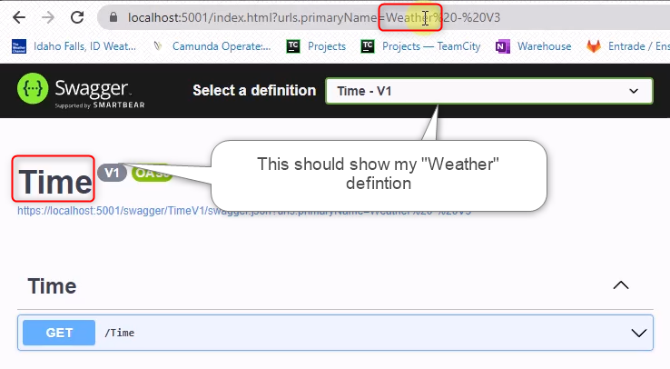

# Steps to Recreate the Problem

Build and Run the Application:

~~~powershell
dotnet clean WebApplication1.sln
dotnet restore WebApplication1.sln
dotnet build WebApplication1.sln
bin\Debug\net6.0\WebApplication1.exe
~~~

Open Google Chrome with the development tools open and "Disable cache" checked:

Access the URL:
* https://localhost:5001/index.html?urls.primaryName=Weather%20-%20V3

You should see the Weather defintion showing.  It shows correctly.

Access the URL:
* https://localhost:5001/index.html?urls.primaryName=Time%20-%20V1

You should see the Time defintion showing.  It shows correctly.

Here is an example of what I expect.  

It is working well when using this version of Swashbuckle.AspNetCore

~~~xml
<PackageReference Include="Swashbuckle.AspNetCore" Version="6.2.3" />
~~~

However, when I switch to 6.4.0 and repeat all of those steps, it does not work correctly.  It shows the wrong definition.  The urls.primaryName does not match the defintion being displayed.

~~~xml
<PackageReference Include="Swashbuckle.AspNetCore" Version="6.4.0" />
~~~

   

   